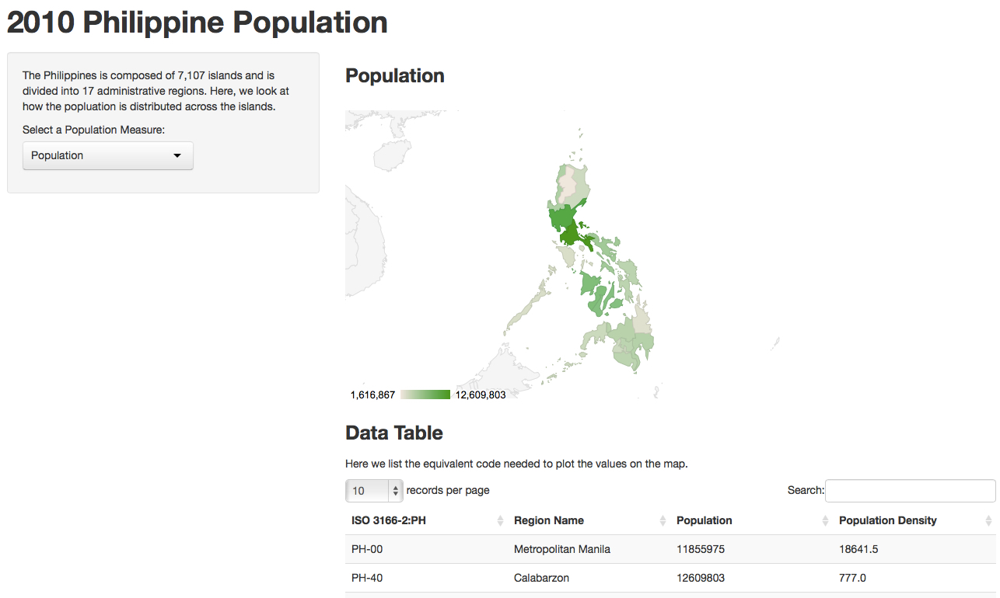

2010 PH Population Map
========================================================
author: PilotGtec EFTL
date: January 18, 2015
font-import: http://fonts.googleapis.com/css?family=Roboto
font-family: 'Roboto'
width: 1440
height: 1000


Application Description
========================================================

The Philippines is an archipelago composed of 7,107 islands with around 100 million people
spread across the islands. Some claim it is already "overpopulated," while others disagree. Is the country
really overpopulated?

This App allows users to visualize how the population is distributed
across the country. Two heatmaps are provided: 

- Population
- Population Density

The app can take one of them as input, which can be chosen from the drop down menu, at a time.

The Population Density gives the number of people per square-kilometer.

Data and Measures
========================================================

The dataset for 2010 was taken from [Wikipedia] (http://en.wikipedia.org/wiki/Regions_of_the_Philippines). Since [GoogleVis] (http://cran.r-project.org/web/packages/googleVis/index.html) was used, the [ISO 3166-2] (http://en.wikipedia.org/wiki/ISO_3166-2:PH) coding was added in the data table (column `Code`) to properly tag the regional names, which is recognized by Google.  The `Code` is used as input in the `gvisGeoChart()` to tag the region.


```
    Code         Region Name Population Pop. Density
1: PH-00 Metropolitan Manila   11855975      18641.5
2: PH-40          Calabarzon   12609803        777.0
3: PH-03       Central Luzon   10137737        472.2
```


App Snapshot
========================================================




On ShinyApps.io and Github
========================================================
You may check the [PH Pop Map] (https://pilotgtec.shinyapps.io/PH-Pop-Map/) app pubilshed on shinyapps.

The code repository for the shiny app can be viewed on [GitHub] (https://github.com/PilotGtec/PHPopApp-Shiny).
